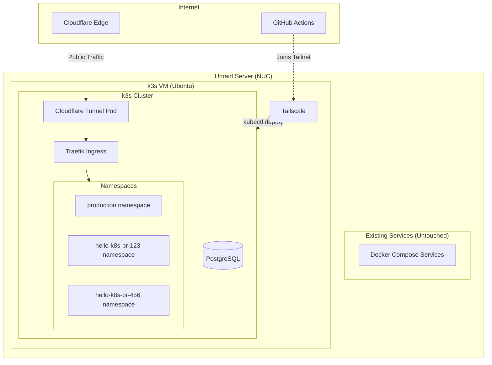
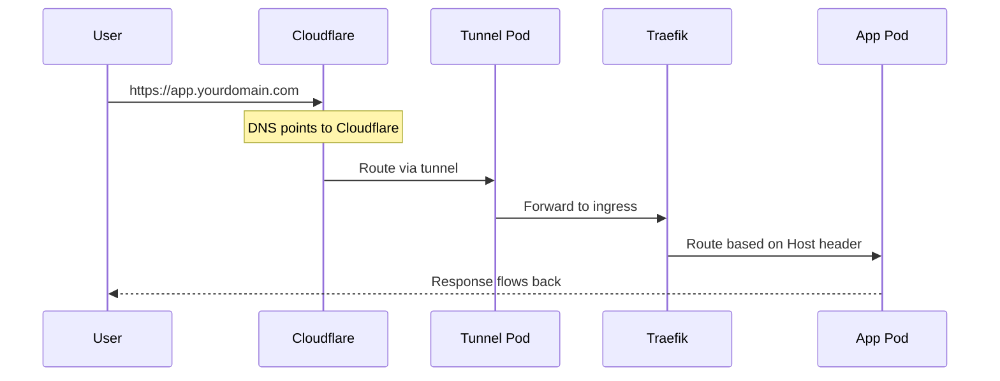
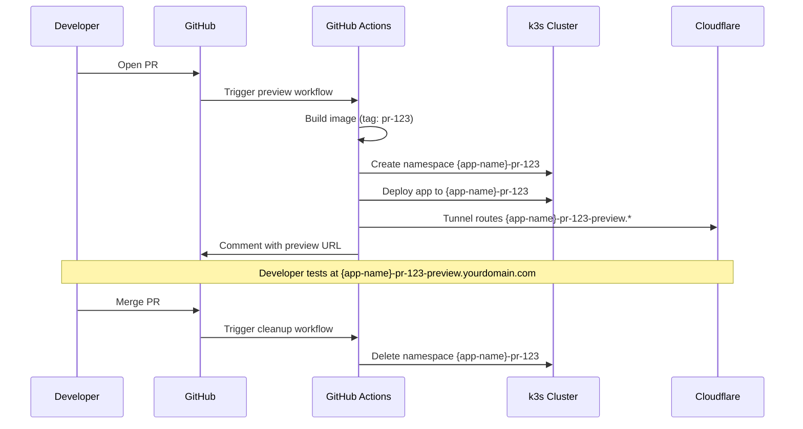

## Architecture Overview

### Cloudflare Tunnel Deployment

Cloudflare Tunnel creates an outbound-only connection from the cluster to Cloudflare's edge. No ports to open, no IP to expose.

### Preview Environment Flow

